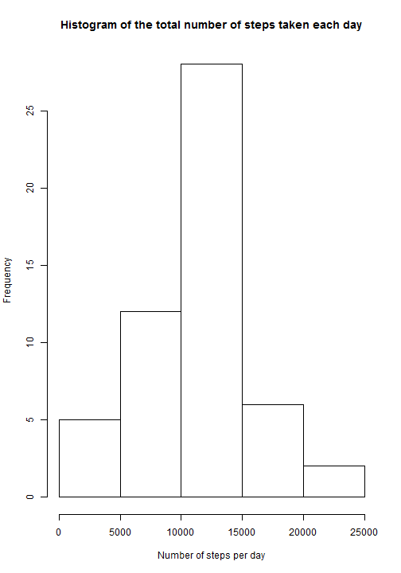
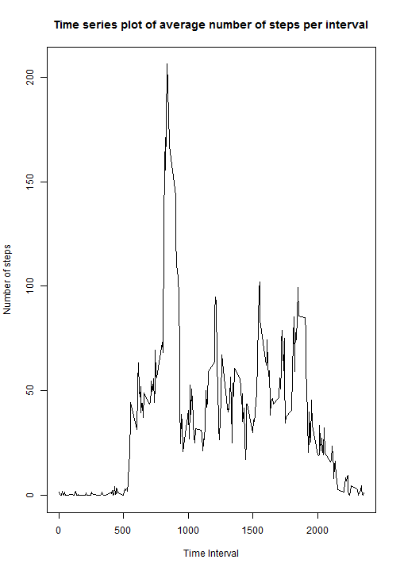
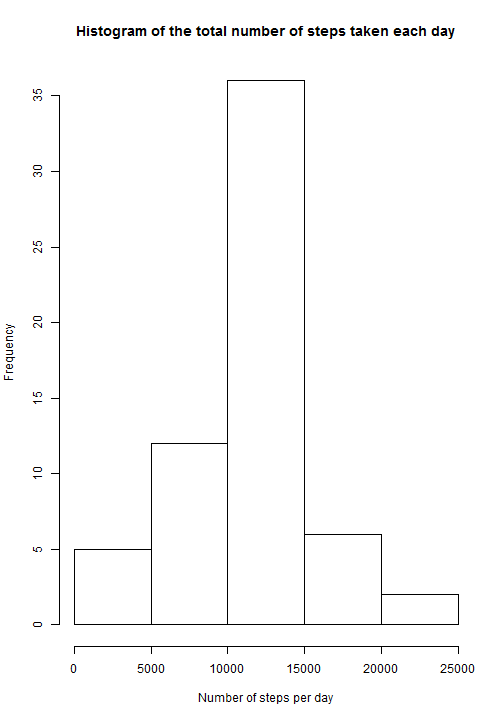
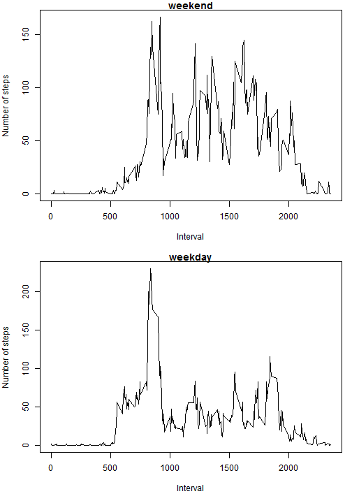

# Reproducible Research: Peer Assessment 1


## Loading and preprocessing the data

```r
data <- read.csv("activity.csv")
data$date <- as.Date(data$date)
```

## What is mean total number of steps taken per day?


```r
stepsByDate <- aggregate(steps ~ date , data , sum)

hist(stepsByDate$steps, main="Histogram of the total number of steps taken each day", xlab="Number of steps per day")
```

 

```r
m1 <- mean(stepsByDate$step)

m2 <- median(stepsByDate$step)
```

The mean of total number of steps taken per day is 1.0766 &times; 10<sup>4</sup>.  
The median of total number of steps taken per day is 10765.  


## What is the average daily activity pattern?


```r
averageStepsPerInterval <- aggregate(steps ~ interval, data , mean)

plot(averageStepsPerInterval$interval,averageStepsPerInterval$steps, type="l", main="Time series plot of average number of steps per interval", xlab="Time Interval", ylab="Number of steps")
```

 

```r
intervalWithMaxSteps <- averageStepsPerInterval[averageStepsPerInterval$steps == max(averageStepsPerInterval$steps),1]
```

835 interval contains the maximum number of steps.  


## Imputing missing values


```r
missingDataRows <- nrow(data[is.na(data$steps),])

completeData <- data
for(id in 1:nrow(completeData)){
	if(is.na(completeData$steps[id])){
		completeData$steps[id] <- averageStepsPerInterval$steps[averageStepsPerInterval$interval == completeData$interval[id]]
	}
}

stepsByDate1 <- aggregate(steps ~ date , completeData , sum)

hist(stepsByDate1$steps, main="Histogram of the total number of steps taken each day", xlab="Number of steps per day")
```

 

```r
m1New <- median(stepsByDate1$step)

m2New <- mean(stepsByDate1$step)
```

The total number of missing values in the dataset is 2304  
The mean of total number of steps taken per day is 1.0766 &times; 10<sup>4</sup>.  
The median of total number of steps taken per day is 1.0766 &times; 10<sup>4</sup>.  
New mean is same as  old value.  
New median is greater than  old value.  

## Are there differences in activity patterns between weekdays and weekends?


```r
completeData$WeekdayType <- NA
completeData$WeekdayType[weekdays(completeData$date) %in% c("Saturday", "Sunday")] <- "weekend"
completeData$WeekdayType[is.na(completeData$WeekdayType)] <- "weekday"

weekendStepsPerInterval <- aggregate(steps ~ interval, completeData[completeData$WeekdayType == "weekend", ] , mean)
weekdayStepsPerInterval <- aggregate(steps ~ interval, completeData[completeData$WeekdayType == "weekday", ] , mean)

par(mfcol = c(2, 1), mar = c(5, 4, 1, 1))

plot(weekendStepsPerInterval$interval,weekendStepsPerInterval$steps, type="l", main="weekend", xlab="Interval", ylab="Number of steps")
plot(weekdayStepsPerInterval$interval,weekdayStepsPerInterval$steps, type="l", main="weekday", xlab="Interval", ylab="Number of steps")
```

 
